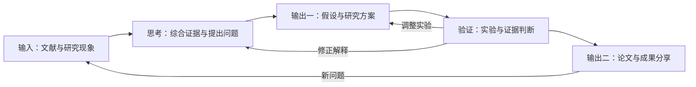

# Research Workflow

用 Zotero、Agentero、Obsidian 与 Codex 串起科研中的阅读、思考、假设、实验和表达。

这个仓库整理一套可以持续使用和迭代的科研流程，以及各环节的 skills、安装包和记录模板。重点是让阅读积累逐渐形成自己的研究问题，并让研究判断接受实验检验。



## 1. 输入：收集、精读与积累

Zotero 管理文献与引用，Agentero 配合 Agent 阅读论文，Obsidian 保存可以继续编辑、关联和综合的研究笔记。

精读之后应留下：研究问题、主要结论、成立条件、关键方法、实验依据、局限，以及它与当前研究的关系。重要判断关联原文的章节、图表或代码位置。

| 入口 | 作用 | 交接成果 |
|---|---|---|
| Zotero → [zotero-paper-reader](catalog/zotero-paper-reader.md) | 定位条目与 PDF，精读并归档到研究库 | 有来源与审阅状态的论文笔记 |
| Agentero 项目内的 paper-reader | 结合文献库原文和已有笔记阅读 | 库内论文讲义 |
| 独立 PDF → [paper-analyzer](catalog/paper-analyzer.md) | 分析方法、公式、实验、代码和局限 | 可持续维护的 Markdown 主稿 |

每条笔记区分作者陈述、实验结果、AI 推断和研究者决定。论文的 DOI 通过出版商或可靠索引核实；尚未分配时保留稳定链接并明确说明。

## 2. 思考：从多篇论文形成研究问题

这一阶段围绕共同的问题组织材料，比较论文之间的共识、分歧和成立条件。

1. **聚合材料**：选取围绕同一现象、任务或机制的论文笔记。
2. **对齐条件**：比较输入信息、数据、假设、评价指标和资源条件。
3. **解释分歧**：定位不同结论是否来自不同条件，找出仍未被解释的现象。
4. **提出问题**：写清具体困难影响什么、已有解释到哪里、还缺什么证据。
5. **选择方向**：结合问题的重要性和可取得的数据，决定下一步投入。

| 能力 | 适用时机 |
|---|---|
| Agentero 的 deep-research | 系统调研与主题综合；[上游综合方法](https://github.com/HKUSTDial/Supervisor-Skills/blob/main/skills/deep-research/references/synthesis-framework.md) |
| [brainstorming-research-ideas](catalog/brainstorming-research-ideas.md) | 从矛盾、失败条件、类比或简化中提出候选解释 |
| [研究问题备忘录](templates/research-question.md) | 将阅读所得整理为候选问题、优先问题和下一份证据 |

这一阶段的主要成果是一页研究问题备忘录：已有证据、关键分歧、未解释现象、优先问题及理由。

## 3. 输出一：形成假设与研究方案

选定问题后，将它写成可检验的研究设想：任务是什么，核心假设是什么，若假设成立应观察到什么，以及什么结果会削弱或推翻它。

- [clarify-research-idea](catalog/clarify-research-idea.md)：明确任务、相近工作、方法结构、假设和验证线索。
- Agentero 的 idea-evaluator：在投入较多资源前讨论相近工作、关键困难与可行性。
- [hypothesis-generation](https://github.com/K-Dense-AI/scientific-agent-skills/blob/main/skills/hypothesis-generation/SKILL.md)：可参考其竞争解释、不同预测和区分性实验设计。

使用 [假设卡](templates/hypothesis.md) 记录当前解释、竞争解释、预期观察和证伪条件。研究者决定选择哪个假设，以及投入多少时间和资源。

## 4. 验证：实验、证据与下一步决定

实验前明确这次运行要区分什么，以及不同结果将如何改变下一步行动。实验中记录配置、数据划分、比较方法与结果来源；实验后回到假设，判断证据支持到哪里。

| 工作 | 记录内容 |
|---|---|
| 实验设计 | 改变什么、固定什么、与谁比较、观察什么 |
| 数据与配置 | 训练、验证和测试的分工；用于选择设置的数据；最终冻结的配置 |
| 实验执行 | 运行环境、代码版本、输入、参数、原始结果与异常 |
| 证据判断 | 观察、解释、竞争解释、适用条件和下一步决定 |

[实验方案](templates/experiment-plan.md) 与 [证据结论](templates/evidence-summary.md) 承接这一阶段。数值图使用 [academic-plotting](catalog/academic-plotting.md)，精确的结构和关系图使用 [drawio-skill](catalog/drawio-skill.md)。

## 5. 输出二：论文、图表与成果分享

围绕证据组织论点，再根据受众选择表达形式。

| 成果 | 对应 skill |
|---|---|
| ML/AI 论文 | [ml-paper-writing](catalog/ml-paper-writing.md) |
| 系统论文 | [systems-paper-writing](catalog/systems-paper-writing.md) |
| 文字整理 | [humanizer](catalog/humanizer.md) |
| 学术图提示词 | [academic-figure-prompt](catalog/academic-figure-prompt.md) |
| 方法与机制图解 | [paper-comic](catalog/paper-comic.md) |
| 逐页生图幻灯片 | [paper-deck](catalog/paper-deck.md) |
| 演讲文案与视觉构思 | [html-copy-studio](catalog/html-copy-studio.md) |
| Markdown 网页阅读版 | [md-to-html](catalog/md-to-html.md) |
| 项目说明与协作文档 | [doc-coauthoring](catalog/doc-coauthoring.md) |
| 通用视觉设计 | [canvas-design](catalog/canvas-design.md) |
| Word 文档 | [docx 来源与使用说明](catalog/docx.md)；Codex 中也可使用 documents 插件 |

需要可编辑的幻灯片文字与图元时，可使用宿主提供的 presentations 能力。分享反馈形成的新问题继续进入阅读和思考环节。

## 工作约定与知识库

三层内容共同支撑这套流程：

- **全局约定**：来源核实、事实与推断区分、表达方式和验证范围。
- **项目约定**：资料位置、领域路由、实验命令、数据边界和成果归档。
- **Skills**：具体任务的可复用方法、脚本、模板和资源。

可从 [AGENTS.md 示例](config-examples/AGENTS.md) 开始，为自己的研究库补充目录和实验约定。不同机器的路径、外部模型服务和数据源在使用时配置。

个人、系统、插件与 Agentero 项目技能的职责见 [Skills 与工作约定的层次](docs/skill-layers.md)。

## Skills 分类与选择

本仓库为 17 个个人 skills 提供简介，其中 16 个附完整安装包。各 skill 的角色建议为 8 个主力、7 个按需使用、2 个备用；角色是选型建议，安装器按指定名称安装。

完整目录见 [Skills 索引](catalog/README.md)，选型理由与 GitHub 同类比较见 [选型说明](docs/selection.md)。

## 安装与使用

### 单个 ZIP 包

从 [安装包目录](packages/README.md) 下载所需 ZIP。解压后得到同名 skill 文件夹，包含 `SKILL.md` 和运行所需资源。

将该文件夹放到 Codex 的个人 skills 目录，或项目的 `.agents/skills/`。具体目录以当前宿主的技能设置为准。

### 使用仓库安装器

克隆或下载仓库后，使用 Python 3.10+：

```bash
python scripts/install_skill.py --list
python scripts/install_skill.py clarify-research-idea
python scripts/install_skill.py paper-comic --dest /path/to/project/.agents/skills
```

默认安装到 `$CODEX_HOME/skills`；未设置 `CODEX_HOME` 时使用 `~/.codex/skills`。`--dest` 指定的是容纳多个 skills 的根目录。已有同名目录时安装器停止，保留现有版本。

安装后让 Codex 重新发现技能；未显示时重启会话。按 skill 名称调用，例如：

```text
使用 clarify-research-idea，基于我的研究问题备忘录，明确核心假设和最小验证方案。
```

Python 库、draw.io、Pandoc、图像服务等依赖见各技能简介。安装器负责安装 skill 文件；外部依赖按实际使用的工作流准备。

## 目录

```text
catalog/          17 个技能简介与选型索引
packages/         16 个完整 ZIP 安装包
docs/             工作流用法、选型与来源说明
templates/        研究问题、假设、实验和证据模板
config-examples/  研究协作约定示例
scripts/          本地安装器
```

## 来源、许可与已知限制

- 安装包来自本地维护版本，保留其上游说明与随附资源。每个包的 `SOURCE.md` 记录来源和本次打包说明。
- `docx` 采用来源索引形式，其现有许可限制再分发；获取方式见对应简介。
- 第三方内容遵循各自许可；本地维护内容的单独许可状态及待确认事项集中记录在 [来源与许可](docs/sources-and-licenses.md)。
- 本次验证覆盖安装包结构、资源保留、安装器和库路径解析。各科研技能的完整执行仍依赖对应资料、工具与服务。
- 仓库维护日期：2026-09-27。
